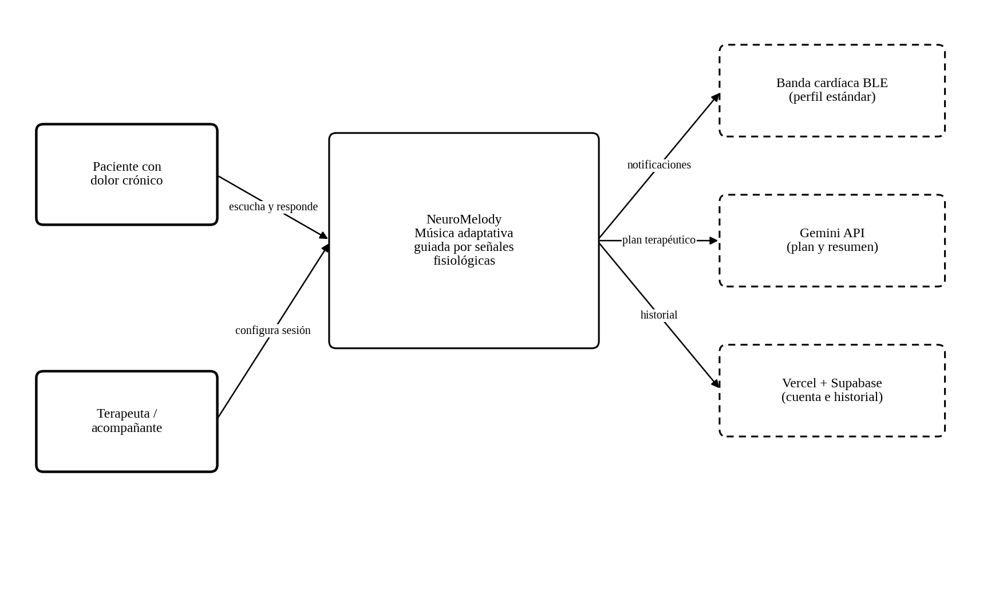
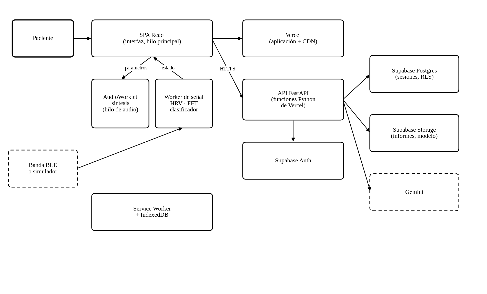
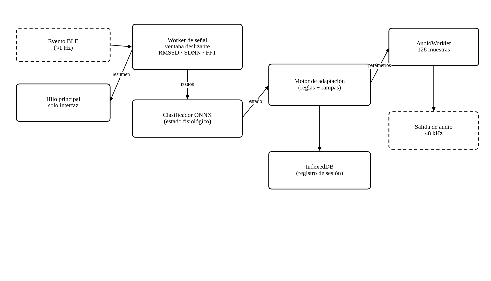

**NeuroMelody: aplicación web de música generativa adaptada en tiempo real a señales fisiológicas como apoyo no farmacológico al manejo del dolor crónico**

Jose Luis Burbano Buchelly

Programación Orientada a la Web

Documento de definición técnica del proyecto

26 de septiembre de 2026

# **Introducción**

Este documento recoge la definición técnica previa a la construcción de NeuroMelody. Su función es fijar, antes de escribir código, el problema que se atiende, el alcance exacto del sistema, su arquitectura, las tecnologías elegidas y los criterios con los que se dará por terminado. En un proyecto donde intervienen señales en vivo, audio en tiempo real y un dominio con implicaciones para la salud de las personas, esta etapa resulta especialmente necesaria: buena parte de las restricciones que condicionan el diseño —latencias máximas, límites de seguridad, manejo de datos sensibles— deben establecerse antes y no descubrirse durante la implementación.

De los tres proyectos de la asignatura, NeuroMelody es el que plantea el problema de concurrencia más exigente, porque no se limita a evitar que la interfaz se congele: exige mantener simultáneamente un flujo de audio sin interrupciones, un procesamiento continuo de señal y una interfaz reactiva, cada uno con su propio presupuesto temporal. Es, en ese sentido, el caso más ilustrativo del modelo de ejecución del navegador.

# **Planteamiento del problema**

El manejo del dolor crónico descansa en buena medida sobre la farmacología opioide, con los riesgos de tolerancia y dependencia que ello conlleva. Las intervenciones no farmacológicas complementarias son, por eso, objeto de interés creciente, y entre ellas la musicoterapia cuenta con respaldo empírico: existe evidencia de que la escucha musical reduce la intensidad percibida del dolor y el consumo de analgésicos en diversos contextos clínicos (Lee, 2016).

Sin embargo, la forma en que esa intervención se aplica en la práctica desaprovecha buena parte de su potencial. Lo habitual son dos escenarios. En el primero, el paciente recibe una lista de reproducción fija, idéntica para todos y que no cambia sin importar cómo evolucione su estado durante la sesión. En el segundo, un terapeuta humano ajusta la música según lo que observa, lo cual es superior pero está limitado por la disponibilidad del profesional, su costo y la imposibilidad de sostenerlo a diario y en el domicilio del paciente.

En ambos casos falta el mismo elemento: **un lazo cerrado entre el estado fisiológico del paciente y la música que suena**. El cuerpo emite continuamente señales relacionadas con el estado del sistema nervioso autónomo —frecuencia cardíaca, variabilidad entre latidos, tensión muscular— y existe literatura que vincula la variabilidad de la frecuencia cardíaca con el balance entre las ramas simpática y parasimpática (Shaffer y Ginsberg, 2017). Esas señales, hoy accesibles mediante dispositivos de consumo de bajo costo, no se están usando para decidir qué música suena en el instante siguiente.

Desde la perspectiva de la programación web, el problema tiene una formulación precisa y exigente. Se trata de construir una aplicación que **sostenga simultáneamente tres flujos de trabajo con presupuestos temporales incompatibles entre sí**: la síntesis de audio, que debe entregar un bloque de muestras cada 2,7 milisegundos sin fallar una sola vez, porque un retraso produce un chasquido audible; el procesamiento de la señal fisiológica, que requiere análisis espectral sobre ventanas de varios minutos; y la interfaz, que debe seguir respondiendo al usuario. Resolver esto en un entorno cuyo modelo de ejecución es de un solo hilo constituye el núcleo técnico del proyecto.

# **Objetivos**

## **Objetivo general**

Diseñar y construir una aplicación web progresiva que genere música de forma continua en el navegador y module sus parámetros en tiempo real a partir de las señales fisiológicas del usuario, capturadas mediante un dispositivo Bluetooth de bajo consumo o un simulador, de modo que la experiencia sonora se adapte al estado del sistema nervioso autónomo, manteniendo un flujo de audio sin interrupciones y registrando la sesión para su revisión posterior.

## **Objetivos específicos**

- Implementar la adquisición de la frecuencia cardíaca y de los intervalos entre latidos mediante la interfaz Web Bluetooth, empleando el perfil estándar de ritmo cardíaco, y un simulador de señal con escenarios reproducibles para el desarrollo y la demostración.

- Calcular en un hilo de trabajo dedicado los índices de variabilidad de la frecuencia cardíaca en los dominios temporal y frecuencial sobre ventanas deslizantes.

- Entrenar fuera de línea un clasificador ligero que estime el estado fisiológico a partir de dichos índices, exportarlo a formato ONNX y ejecutarlo en el navegador.

- Construir un motor de música generativa sobre la Web Audio API que sintetice capas sonoras cuyo tempo, tonalidad, densidad y timbre sean controlables de forma continua.

- Diseñar un motor de adaptación que traduzca el estado estimado en cambios musicales graduales, garantizando que ninguna transición resulte abrupta.

- Integrar un modelo de lenguaje que proponga el plan de la sesión a partir de los objetivos declarados y redacte un resumen comprensible al finalizar.

- Registrar cada sesión de forma local y sincronizarla con la nube, permitiendo al usuario revisar la evolución de sus indicadores a lo largo del tiempo.

- Establecer y verificar los límites de seguridad del sistema: nivel máximo de presión sonora, duración máxima de sesión, detención inmediata y advertencias explícitas sobre su carácter no clínico.

# **Alcance, delimitación y advertencias**

Este proyecto toca un dominio sensible, de modo que la delimitación cumple aquí una doble función: acotar el trabajo y acotar también lo que el sistema puede legítimamente afirmar sobre sí mismo.

**Tabla 1**

*Delimitación del alcance de NeuroMelody*

| **Dentro del alcance**                                                                  | **Fuera del alcance**                                                                     |
|-----------------------------------------------------------------------------------------|-------------------------------------------------------------------------------------------|
| Lectura de frecuencia cardíaca e intervalos RR desde bandas BLE con perfil estándar.    | Electromiografía, electroencefalografía o cualquier señal que requiera hardware a medida. |
| Simulador de señal con escenarios reproducibles y reproducción de registros de ejemplo. | Adquisición de señal por métodos ópticos con la cámara del dispositivo.                   |
| Índices de variabilidad en dominio temporal y frecuencial sobre ventanas deslizantes.   | Diagnóstico, detección de arritmias o cualquier interpretación clínica de la señal.       |
| Clasificación del estado fisiológico en categorías amplias de activación.               | Medición o estimación del dolor, que es un fenómeno subjetivo no observable directamente. |
| Música generativa por síntesis en el navegador, con parámetros modulables.              | Reproducción de obras musicales protegidas por derechos de autor.                         |
| Adaptación gradual de tempo, tonalidad, densidad y timbre.                              | Estimulación binaural con pretensiones terapéuticas específicas.                          |
| Registro de sesiones, historial e informes descargables.                                | Historia clínica, integración con sistemas hospitalarios o telemedicina.                  |
| Funcionamiento sin conexión de la sesión completa.                                      | Cualquier afirmación de eficacia terapéutica o de sustitución de tratamiento.             |

## **Advertencias de uso incorporadas al producto**

Las siguientes advertencias no son un anexo legal sino requisitos funcionales del sistema, verificables como cualquier otro:

- La aplicación se presenta de manera explícita como una herramienta de bienestar y acompañamiento, no como un dispositivo médico, y no está certificada como tal.

- En ningún momento la interfaz afirma medir el dolor, ni sugiere modificar, suspender o sustituir un tratamiento prescrito.

- Antes de la primera sesión el usuario debe confirmar que ha leído estas condiciones y que su uso es complementario al seguimiento de su profesional de la salud.

- El sistema no emite alertas clínicas ni interpreta valores anómalos de la señal; si detecta lecturas fuera de rango plausible, informa que la medición no es fiable y recomienda revisar el dispositivo.

- La reproducción se detiene con un control siempre visible y accesible desde el teclado.

# **Actores e historias de usuario**

**Tabla 2**

*Actores identificados y sus objetivos*

| **Actor**               | **Descripción**                                                                                   | **Objetivo principal**                                                                             |
|-------------------------|---------------------------------------------------------------------------------------------------|----------------------------------------------------------------------------------------------------|
| Paciente                | Persona con dolor crónico que utiliza la aplicación por su cuenta, habitualmente en su domicilio. | Realizar una sesión de escucha que acompañe su estado y ayude a reducir la activación fisiológica. |
| Terapeuta o acompañante | Profesional o familiar que configura la sesión y revisa la evolución.                             | Ajustar parámetros y objetivos, y consultar el historial.                                          |
| Administrador           | Responsable técnico del despliegue.                                                               | Supervisar disponibilidad, errores y costos.                                                       |
| Dispositivo BLE         | Banda o pulsera con el perfil estándar de ritmo cardíaco.                                         | Entregar frecuencia cardíaca e intervalos entre latidos.                                           |

**Tabla 3**

*Historias de usuario y criterios de aceptación*

| **Id** | **Historia**                                                                                       | **Criterio de aceptación**                                                                                            |
|--------|----------------------------------------------------------------------------------------------------|-----------------------------------------------------------------------------------------------------------------------|
| HU-01  | Como paciente quiero vincular mi banda cardíaca desde el navegador sin instalar nada.              | El emparejamiento se completa en menos de 15 s y el estado de conexión es visible en todo momento.                    |
| HU-02  | Como paciente quiero probar la aplicación aunque no tenga banda.                                   | El simulador ofrece al menos tres escenarios y es indistinguible del dispositivo real para el resto del sistema.      |
| HU-03  | Como paciente quiero que la música empiece de inmediato y no se corte nunca.                       | El audio comienza en menos de 1 s tras la interacción y no se registra ninguna interrupción en 30 minutos continuos.  |
| HU-04  | Como paciente quiero que la música se adapte a cómo estoy, sin cambios bruscos que me sobresalten. | Toda transición de tempo o tonalidad se completa de forma gradual en no menos de 20 s.                                |
| HU-05  | Como paciente quiero ver de forma sencilla cómo evoluciona mi estado durante la sesión.            | La visualización se actualiza al menos cada 5 s sin producir saltos en la interfaz.                                   |
| HU-06  | Como paciente quiero detener todo de inmediato si algo me incomoda.                                | El control de detención está siempre visible, es alcanzable por teclado y silencia el audio en menos de 200 ms.       |
| HU-07  | Como terapeuta quiero fijar los objetivos de la sesión y su duración.                              | El plan resultante se muestra antes de comenzar y puede ajustarse manualmente.                                        |
| HU-08  | Como paciente quiero entender qué pasó en mi sesión.                                               | Al finalizar se genera un resumen con indicadores y texto en lenguaje llano, señalado como interpretación automática. |
| HU-09  | Como paciente quiero usar la aplicación sin conexión a internet.                                   | La sesión completa funciona sin red y se sincroniza al recuperarla.                                                   |
| HU-10  | Como paciente quiero revisar mis sesiones anteriores.                                              | El historial muestra la evolución de los indicadores por sesión.                                                      |

# **Requisitos**

## **Requisitos funcionales**

**Tabla 4**

*Requisitos funcionales de NeuroMelody*

| **Id** | **Requisito**                                                                                         | **Prioridad** |
|--------|-------------------------------------------------------------------------------------------------------|---------------|
| RF-01  | Descubrir, emparejar y reconectar dispositivos BLE que expongan el perfil estándar de ritmo cardíaco. | Alta          |
| RF-02  | Proveer un simulador de señal con escenarios reproducibles y velocidad configurable.                  | Alta          |
| RF-03  | Extraer frecuencia cardíaca e intervalos entre latidos de las notificaciones recibidas.               | Alta          |
| RF-04  | Filtrar latidos anómalos y marcar los tramos de señal de baja calidad.                                | Alta          |
| RF-05  | Calcular índices de variabilidad en dominio temporal sobre ventana deslizante.                        | Alta          |
| RF-06  | Calcular la densidad espectral de potencia y las razones entre bandas de frecuencia.                  | Media         |
| RF-07  | Estimar el estado fisiológico mediante el clasificador ejecutado en el navegador.                     | Media         |
| RF-08  | Sintetizar música generativa por capas con parámetros modulables de forma continua.                   | Alta          |
| RF-09  | Modular tempo, tonalidad, densidad, brillo y reverberación según el estado estimado.                  | Alta          |
| RF-10  | Garantizar que toda transición musical sea gradual y nunca instantánea.                               | Alta          |
| RF-11  | Ofrecer controles de reproducción, volumen y detención inmediata siempre accesibles.                  | Alta          |
| RF-12  | Visualizar en tiempo real la señal, los indicadores y el estado estimado.                             | Alta          |
| RF-13  | Proponer un plan de sesión a partir de los objetivos declarados mediante el modelo de lenguaje.       | Media         |
| RF-14  | Registrar la sesión completa localmente y sincronizarla con la nube.                                  | Alta          |
| RF-15  | Generar al final un resumen de la sesión y permitir su descarga.                                      | Media         |
| RF-16  | Mostrar el historial y la evolución de los indicadores entre sesiones.                                | Media         |
| RF-17  | Requerir la aceptación explícita de las advertencias de uso antes de la primera sesión.               | Alta          |
| RF-18  | Limitar el nivel de salida y advertir al superar la duración recomendada.                             | Alta          |

## **Requisitos no funcionales**

**Tabla 5**

*Requisitos no funcionales de NeuroMelody*

| **Id** | **Atributo**                 | **Requisito verificable**                                                                                                                     |
|--------|------------------------------|-----------------------------------------------------------------------------------------------------------------------------------------------|
| RNF-01 | Continuidad del audio        | Ninguna interrupción del flujo de audio en 30 minutos de sesión continua, verificada mediante el contador de subdesbordamientos del contexto. |
| RNF-02 | Latencia de adaptación       | El cambio de parámetros musicales se inicia en menos de 2 s desde que el estado estimado cambia.                                              |
| RNF-03 | Suavidad de las transiciones | Ninguna rampa de tempo o tonalidad dura menos de 20 s.                                                                                        |
| RNF-04 | Capacidad de respuesta       | Ninguna tarea del hilo principal excede 50 ms durante la sesión.                                                                              |
| RNF-05 | Consumo                      | La sesión no consume más del 35 % de un núcleo en un equipo de gama media.                                                                    |
| RNF-06 | Seguridad auditiva           | El nivel de salida se limita por omisión y se advierte al superar 60 minutos continuos.                                                       |
| RNF-07 | Privacidad                   | Las señales fisiológicas se procesan en el dispositivo; solo se sincronizan resúmenes agregados si el usuario lo autoriza.                    |
| RNF-08 | Funcionamiento sin conexión  | La sesión completa funciona sin red, incluidos el clasificador y la síntesis.                                                                 |
| RNF-09 | Accesibilidad                | Nivel AA de las WCAG 2.1, con controles alcanzables por teclado y alternativas no sonoras al estado.                                          |
| RNF-10 | Compatibilidad               | Chrome y Edge de escritorio y Android para la función Bluetooth; el resto de navegadores operan con el simulador.                             |
| RNF-11 | Mantenibilidad               | Cobertura de pruebas ≥ 70 % en el procesamiento de señal y el motor de adaptación.                                                            |
| RNF-12 | Costo                        | Cero dólares, usando solo planes gratuitos que no exigen tarjeta de crédito.                                                                  |

Conviene señalar que el RNF-10 refleja una limitación real y no una omisión del diseño: la interfaz Web Bluetooth no está implementada en Safari ni en Firefox. Lejos de ser un obstáculo, esta restricción justifica arquitectónicamente la existencia del simulador y obliga a diseñar la capa de adquisición de modo que la fuente de señal sea intercambiable, lo que constituye una buena práctica con independencia del soporte de los navegadores.

# **Arquitectura de la solución**

## **Estilo arquitectónico y justificación**

La arquitectura se organiza como un **sistema de lazo cerrado que se ejecuta íntegramente en el dispositivo del usuario**, con una nube que cumple funciones de identidad, persistencia y apoyo, pero que no participa en el lazo de control. La razón es determinante: el ciclo que va de la señal a la música debe cerrarse en segundos y no puede depender de la conectividad. Un paciente en una sesión de relajación no debe quedarse sin música porque se cayó la red.

Internamente el sistema se descompone en cuatro etapas encadenadas —adquisición, análisis, decisión y síntesis— que se comunican mediante flujos de datos unidireccionales. Esta disposición, próxima al estilo de tuberías y filtros, tiene la ventaja de que cada etapa puede probarse de forma aislada alimentándola con datos registrados, algo particularmente valioso cuando la entrada real proviene de un dispositivo físico que no siempre está disponible durante el desarrollo.

## **Vista de contexto**

**Figura 1**

*Diagrama de contexto de NeuroMelody*

*Nota.* Elaboración propia con base en el modelo C4 (Brown, 2018).

## **Vista de contenedores**

**Figura 2**

*Diagrama de contenedores de NeuroMelody*

*Nota.* Elaboración propia.

**Tabla 6**

*Responsabilidad de cada contenedor*

| **Contenedor**             | **Responsabilidad**                                                       | **Tecnología**                        |
|----------------------------|---------------------------------------------------------------------------|---------------------------------------|
| Aplicación de página única | Presentar la interfaz y coordinar las etapas; no realiza cálculo pesado.  | React 19, TypeScript, Vite            |
| Procesador de audio        | Sintetizar el audio muestra a muestra en el hilo de audio de tiempo real. | AudioWorklet, Web Audio API, Tone.js  |
| Hilo de señal              | Filtrar la señal, calcular los índices y ejecutar el clasificador.        | Web Worker, ONNX Runtime Web          |
| Capa de adquisición        | Abstraer la fuente de señal tras una interfaz común.                      | Web Bluetooth o simulador             |
| Trabajador de servicio     | Permitir el funcionamiento sin conexión y almacenar la sesión.            | Workbox, IndexedDB                    |
| Interfaz de programación   | Autorizar, persistir sesiones y consultar el modelo de lenguaje.          | FastAPI en funciones Python de Vercel |
| Servicio de identidad      | Autenticar usuarios y emitir credenciales.                                | Supabase Auth                         |
| Almacén de sesiones        | Guardar series temporales de indicadores por sesión.                      | Supabase PostgreSQL                   |

## **El lazo de adaptación**

El lazo de control constituye el corazón funcional del sistema y conviene describirlo con precisión. La señal llega desde el dispositivo aproximadamente una vez por segundo. El hilo de señal mantiene una ventana deslizante de los últimos cinco minutos y recalcula los índices cada cinco segundos; el clasificador produce entonces una estimación del estado. El motor de adaptación no reacciona de inmediato a esa estimación: aplica una histéresis que exige que el nuevo estado se sostenga durante al menos tres estimaciones consecutivas antes de aceptar el cambio.

Esta histéresis es una decisión de diseño deliberada, no una limitación. La variabilidad cardíaca es intrínsecamente ruidosa, y un sistema que persiguiera cada fluctuación produciría una música errática que, lejos de relajar, resultaría inquietante. El sistema prefiere equivocarse por lentitud antes que por nerviosismo, criterio que la propia finalidad terapéutica impone.

Aceptado un cambio de estado, el motor no modifica los parámetros de golpe sino que programa rampas: el tempo se desplaza a razón de un pulso por minuto cada dos segundos, los cambios de tonalidad esperan al final del ciclo armónico en curso y las variaciones de timbre se interpolan a lo largo de decenas de segundos. El resultado buscado es que el usuario perciba que la música evoluciona, no que reacciona.

# **Registros de decisión de arquitectura**

Cada registro documenta una elección estructural, las alternativas consideradas y sus consecuencias (Nygard, 2011), de modo que el razonamiento quede disponible cuando convenga revisar la decisión.

**Tabla 7**

*ADR-01. Cerrar el lazo de control íntegramente en el dispositivo*

| **Campo**     | **Contenido**                                                                                                                                                                              |
|---------------|--------------------------------------------------------------------------------------------------------------------------------------------------------------------------------------------|
| Contexto      | El ciclo señal–música debe cerrarse en segundos y la sesión puede realizarse sin conexión estable.                                                                                         |
| Decisión      | Adquisición, análisis, decisión y síntesis se ejecutan en el navegador; la nube no participa en el lazo.                                                                                   |
| Alternativas  | Analizar la señal en el servidor y devolver los parámetros musicales.                                                                                                                      |
| Consecuencias | La sesión es robusta ante fallos de red y los datos fisiológicos no salen del dispositivo. A cambio, el rendimiento depende del equipo del usuario y el modelo debe caber en el navegador. |

**Tabla 8**

*ADR-02. Sintetizar la música en lugar de reproducir audio pregrabado*

| **Campo**     | **Contenido**                                                                                                                                                                                                                    |
|---------------|----------------------------------------------------------------------------------------------------------------------------------------------------------------------------------------------------------------------------------|
| Contexto      | Se requiere modular tempo, tonalidad y timbre de forma continua y sin cortes perceptibles.                                                                                                                                       |
| Decisión      | La música se genera por síntesis en un AudioWorklet, con parámetros controlables muestra a muestra.                                                                                                                              |
| Alternativas  | Biblioteca de fragmentos pregrabados mezclados por fundido cruzado.                                                                                                                                                              |
| Consecuencias | Se obtiene continuidad real y control fino, además de evitar cualquier problema de derechos sobre obras existentes. El costo es una mayor complejidad y una calidad tímbrica inferior a la de material grabado profesionalmente. |

**Tabla 9**

*ADR-03. Abstraer la fuente de señal tras una interfaz común*

| **Campo**     | **Contenido**                                                                                                                      |
|---------------|------------------------------------------------------------------------------------------------------------------------------------|
| Contexto      | Web Bluetooth no está disponible en todos los navegadores y el dispositivo físico no siempre está a mano durante el desarrollo.    |
| Decisión      | Banda BLE, simulador y reproducción de registros implementan un mismo contrato de fuente de señal.                                 |
| Alternativas  | Acoplar la aplicación directamente a la interfaz Web Bluetooth.                                                                    |
| Consecuencias | El sistema es probable de forma determinista y demostrable en cualquier navegador; se añade una capa de indirección de bajo costo. |

**Tabla 10**

*ADR-04. Emplear un clasificador simple e interpretable*

| **Campo**     | **Contenido**                                                                                                                                                                                 |
|---------------|-----------------------------------------------------------------------------------------------------------------------------------------------------------------------------------------------|
| Contexto      | El estado fisiológico debe estimarse en el navegador, con datos de entrenamiento limitados y en un dominio sensible.                                                                          |
| Decisión      | Modelo supervisado ligero exportado a ONNX, ejecutado en el hilo de señal.                                                                                                                    |
| Alternativas  | Red neuronal profunda; reglas fijas sin aprendizaje.                                                                                                                                          |
| Consecuencias | Tamaño reducido, inferencia inmediata y decisiones explicables, a costa de una exactitud probablemente menor que la de un modelo mayor, compensada por la histéresis del motor de adaptación. |

**Tabla 11**

*ADR-05. Excluir al modelo de lenguaje del lazo de control*

| **Campo**     | **Contenido**                                                                                                       |
|---------------|---------------------------------------------------------------------------------------------------------------------|
| Contexto      | Un modelo de lenguaje tiene latencia variable, requiere red y puede producir salidas imprevistas.                   |
| Decisión      | El modelo solo propone el plan inicial y redacta el resumen final; nunca decide qué suena en el instante siguiente. |
| Alternativas  | Delegar en el modelo la selección continua de parámetros musicales.                                                 |
| Consecuencias | El comportamiento en tiempo real es determinista, reproducible y funciona sin conexión.                             |

**Tabla 12**

*ADR-06. Desplegar sobre plataformas gratuitas con portabilidad a AWS*

| **Campo**     | **Contenido**                                                                                                                                                                                                                                                               |
|---------------|-----------------------------------------------------------------------------------------------------------------------------------------------------------------------------------------------------------------------------------------------------------------------------|
| Contexto      | El proyecto es académico, con tráfico intermitente y sin presupuesto; no es posible registrar un medio de pago.                                                                                                                                                             |
| Decisión      | Aplicación y API en Vercel; identidad, base de datos PostgreSQL y archivos en Supabase. El diseño se mantiene portable a AWS.                                                                                                                                               |
| Alternativas  | Arquitectura sin servidor en AWS; servidor propio con contenedores.                                                                                                                                                                                                         |
| Consecuencias | Costo cero y sin servidores que administrar. A cambio se aceptan los límites de los planes gratuitos —pausa por inactividad, tamaño de base de datos, cuerpo máximo de 4,5 MB— y el riesgo de que sus condiciones cambien, mitigado con la equivalencia documentada en AWS. |

# **Modelo de concurrencia y tiempo real**

Esta sección aborda el aspecto más exigente del proyecto y el de mayor valor formativo, pues obliga a distinguir con claridad tres contextos de ejecución con requisitos temporales radicalmente distintos.

## **Los tres relojes del sistema**

**Figura 3**

*Modelo de hilos y flujo de datos de NeuroMelody*

*Nota.* Elaboración propia.

**Tabla 13**

*Contextos de ejecución y sus presupuestos temporales*

| **Contexto**                 | **Periodo**                      | **Consecuencia de incumplirlo**                          | **Restricción de diseño**                                                |
|------------------------------|----------------------------------|----------------------------------------------------------|--------------------------------------------------------------------------|
| Hilo de audio (AudioWorklet) | ≈2,7 ms (128 muestras a 48 kHz)  | Chasquido o silencio audible, inmediatamente perceptible | Prohibido reservar memoria, esperar bloqueos o realizar entrada y salida |
| Hilo de señal (Worker)       | Cada 5 s, sobre ventana de 5 min | Retraso en la adaptación, apenas perceptible             | Puede usar cálculo intensivo; comunica por mensajes                      |
| Hilo principal               | 16,7 ms por cuadro               | Interfaz con retardo, animaciones entrecortadas          | Solo interfaz y coordinación; nada de análisis                           |

La diferencia de escala es notable: el hilo de audio opera en un régimen mil ochocientas veces más estricto que el hilo de señal. Confundir ambos contextos es el error más frecuente en aplicaciones de audio web, y se manifiesta de forma inconfundible en forma de chasquidos cuando el cálculo pesado invade el hilo equivocado.

## **El hilo de audio**

La Web Audio API ejecuta el procesamiento en un hilo de prioridad alta, separado del hilo principal. Un AudioWorklet permite insertar código propio en ese hilo, y ese código se somete a las reglas de la programación de tiempo real: el método de procesamiento se invoca con una regularidad estricta y debe retornar antes del siguiente bloque. Reservar memoria dentro de él desencadenaría eventualmente una pausa del recolector de basura justo en el peor momento posible.

En consecuencia, todos los búferes se reservan durante la inicialización, la comunicación con el hilo principal se realiza mediante un búfer circular sobre memoria compartida en lugar de mensajes, y los cambios de parámetro se aplican a través del mecanismo de automatización de la propia interfaz, que interpola valores en el propio hilo de audio sin intervención externa. Esta última técnica es la que hace posible que una rampa de veinte segundos suene perfectamente lisa aunque el hilo principal esté ocupado.

## **El hilo de señal**

El análisis de la variabilidad cardíaca es costoso: exige interpolar la serie de intervalos a una frecuencia uniforme, aplicar una ventana, calcular la transformada rápida de Fourier e integrar la potencia por bandas. Sobre ventanas de cinco minutos este trabajo supera con holgura el presupuesto de un cuadro, por lo que reside en un Worker dedicado. Ese mismo Worker aloja el clasificador ONNX, de modo que la inferencia tampoco toca el hilo principal.

## **El hilo principal**

Al hilo principal solo le quedan la interfaz y la coordinación. Incluso ahí se aplican cuidados: la visualización de la señal se dibuja sobre un lienzo transferido a un Worker, y la actualización de los indicadores se limita a una frecuencia de cinco segundos, suficiente para el usuario y muy inferior a lo que el sistema podría ofrecer. Actualizar más a menudo no aportaría nada y consumiría presupuesto sin beneficio.

## **Una restricción adicional: la pestaña en segundo plano**

Los navegadores limitan la ejecución de temporizadores en pestañas no visibles, lo que podría interrumpir una sesión cuando el usuario cambia de aplicación. Como el hilo de audio no está sujeto a esa limitación mientras el contexto permanece activo, el diseño delega en él toda la temporización musical y evita depender de temporizadores del hilo principal para cualquier evento sonoro. Esta es una de esas restricciones de plataforma que, descubiertas tarde, obligan a rehacer el motor completo; identificarla en la etapa de diseño es precisamente el propósito de este documento.

# **Integración de la inteligencia artificial**

La inteligencia artificial interviene en dos planos distintos, con responsabilidades claramente separadas.

## **Clasificador de estado fisiológico**

Un modelo supervisado ligero —regresión logística o árbol de decisión con refuerzo, según el desempeño obtenido— se entrena fuera de línea sobre conjuntos de datos públicos de variabilidad cardíaca, empleando como rasgos los índices calculados por el hilo de señal. El modelo resultante se exporta a formato ONNX, ocupa unas decenas de kilobytes y se ejecuta en el navegador mediante ONNX Runtime Web. Su salida es una categoría amplia de activación fisiológica acompañada de una medida de confianza.

Se opta deliberadamente por un modelo sencillo y no por una red profunda. La razón es doble: por un lado, el volumen de datos disponible no justifica mayor complejidad; por otro, un modelo simple es interpretable, y en un sistema que actúa sobre el estado de una persona poder explicar por qué se tomó una decisión tiene más valor que un pequeño incremento de exactitud.

## **Modelo de lenguaje**

El modelo de lenguaje cumple dos funciones acotadas. Antes de la sesión traduce los objetivos declarados por el usuario en un plan de parámetros musicales iniciales, eligiendo entre un conjunto cerrado de valores permitidos y no de forma libre. Después de la sesión redacta un resumen en lenguaje llano a partir de los indicadores registrados.

Tres restricciones gobiernan su uso. El modelo **no participa en el lazo de control**: jamás decide qué suena en el instante siguiente, responsabilidad que recae exclusivamente en el motor determinista. El modelo **no interpreta clínicamente**: el esquema de la petición y la instrucción del sistema le impiden emitir diagnósticos o recomendaciones de tratamiento. Y su salida **se identifica siempre como texto generado automáticamente**.

# **Modelo de datos y diseño de la interfaz de programación**

Los datos se guardan en PostgreSQL, provisto por Supabase. La estructura es relacional —un usuario tiene planes y sesiones, una sesión tiene una serie de indicadores— y se beneficia de integridad referencial y de borrado en cascada, propiedad que aquí tiene valor ético además de técnico: cuando el usuario elimina una sesión o su cuenta, todos los datos fisiológicos asociados desaparecen con ella.

**Tabla 14**

*Tablas principales de la base de datos*

| **Tabla**       | **Clave y relaciones**                       | **Columnas principales**                                               |
|-----------------|----------------------------------------------|------------------------------------------------------------------------|
| profiles        | id (= usuario de Supabase Auth)              | alias, preferencias (JSONB), fecha de aceptación de las advertencias   |
| plans           | id; owner_id → profiles                      | objetivos, parámetros iniciales (JSONB), duración                      |
| sessions        | id; owner_id → profiles; plan_id → plans     | inicio, fin, estado final, resumen generado                            |
| session_metrics | (session_id, segundo); session_id → sessions | frecuencia media, RMSSD, SDNN, razón LF/HF, estado estimado, confianza |
| model_versions  | versión                                      | ruta en Storage, huella SHA-256, métricas, fecha de publicación        |

*Nota.* Las series temporales se agregan a una muestra cada cinco segundos antes de sincronizarse: una sesión de 30 minutos ocupa 360 filas, lo que permite guardar miles de sesiones dentro de los 500 MB del plan gratuito.

Todas las tablas con datos de usuario tienen activada la seguridad a nivel de fila, de modo que la propia base de datos impide que un usuario lea sesiones ajenas aunque la API tuviera un error.

**Tabla 15**

*Puntos de acceso principales de la interfaz*

| **Método y ruta**              | **Propósito**                                               | **Autenticación** |
|--------------------------------|-------------------------------------------------------------|-------------------|
| POST /v1/sessions              | Registrar una sesión finalizada con su serie de indicadores | Requerida         |
| GET /v1/sessions               | Listar las sesiones del usuario                             | Requerida         |
| GET /v1/sessions/{id}          | Recuperar el detalle de una sesión                          | Requerida         |
| POST /v1/plans/suggest         | Solicitar un plan de sesión al modelo de lenguaje           | Requerida         |
| POST /v1/sessions/{id}/summary | Generar el resumen de la sesión                             | Requerida         |
| GET /v1/models/classifier      | Descargar la versión vigente del clasificador               | Requerida         |
| GET /v1/health                 | Verificar el estado del servicio                            | Pública           |

El clasificador se guarda en Supabase Storage, se entrega desde la interfaz y no se empaqueta dentro de la aplicación, decisión que permite publicar una versión mejorada del modelo sin volver a desplegar el cliente. El trabajador de servicio lo almacena en caché con su número de versión, de modo que la aplicación siga funcionando sin conexión con el último modelo descargado.

# **Infraestructura, despliegue y operación**

## **Plataforma de despliegue**

El sistema se despliega sobre plataformas con **plan gratuito que no exigen tarjeta de crédito**: Vercel para la aplicación y la API, y Supabase para identidad, base de datos y archivos. La elección es viable precisamente por la arquitectura adoptada: como el cómputo intensivo ocurre en el navegador, al servidor solo le quedan tareas ligeras —autenticar, guardar datos y llamar al modelo de lenguaje— que caben holgadamente en los límites de esos planes.

**Tabla 16**

*Servicios empleados en la opción gratuita*

| **Servicio**                   | **Función en el sistema**                                                                                                                 | **Límite del plan gratuito**                                                |
|--------------------------------|-------------------------------------------------------------------------------------------------------------------------------------------|-----------------------------------------------------------------------------|
| Vercel (plan Hobby)            | Alojar la aplicación, distribuirla desde su red de entrega y aplicar las cabeceras de seguridad y de aislamiento definidas en vercel.json | Gratuito para uso no comercial                                              |
| Funciones Python de Vercel     | Ejecutar la API FastAPI como funciones sin servidor                                                                                       | Incluidas en el plan gratuito; hasta 2 GB de memoria y 300 s por invocación |
| Supabase Auth                  | Registro, inicio de sesión y emisión de credenciales JWT                                                                                  | Hasta 50.000 usuarios activos mensuales                                     |
| Supabase PostgreSQL            | Persistir los datos con seguridad a nivel de fila                                                                                         | Hasta 500 MB de base de datos                                               |
| Supabase Storage               | Guardar archivos: informes y demás objetos binarios                                                                                       | Hasta 1 GB de almacenamiento                                                |
| Variables de entorno de Vercel | Custodiar la clave de Gemini y la clave de servicio de Supabase, cifradas y solo accesibles desde el servidor                             | Sin costo                                                                   |
| GitHub Actions                 | Integración continua y tareas programadas de mantenimiento                                                                                | Gratuito en repositorios públicos; 2.000 minutos mensuales en privados      |
| Registros de Vercel y Sentry   | Trazas, errores y alertas                                                                                                                 | Planes gratuitos                                                            |
| Supabase Storage (modelo)      | Publicar las versiones del clasificador ONNX, de unas decenas de kilobytes cada una                                                       | Incluido en 1 GB                                                            |

*Nota.* Límites vigentes a septiembre de 2026. Los planes gratuitos cambian con frecuencia, por lo que deben revisarse al iniciar la construcción.

Tres restricciones de estos planes condicionan el diseño y conviene tenerlas presentes desde ahora. La primera es que el plan Hobby de Vercel admite solo uso no comercial, condición que un proyecto académico cumple. La segunda es que una función de Vercel no acepta cuerpos de petición mayores de 4,5 MB, de modo que los archivos voluminosos no pasan por la API: el cliente los sube directamente a Supabase Storage mediante una URL firmada que la API emite. La tercera es que Supabase **pausa los proyectos gratuitos tras una semana sin actividad**; para evitar que el sistema amanezca detenido el día de la sustentación, un flujo programado de GitHub Actions realiza una consulta ligera cada tres días.

## **Estrategia de despliegue**

Vercel se integra directamente con el repositorio de GitHub. Cada propuesta de cambio genera automáticamente un **despliegue de vista previa** con su propia dirección, que cumple la función de entorno de preproducción, y cada integración a la rama principal se publica en producción. El esquema de la base de datos se versiona en el mismo repositorio como migraciones SQL gestionadas con la interfaz de línea de comandos de Supabase, y las cabeceras de seguridad se declaran en vercel.json. De este modo toda la configuración queda descrita en archivos versionados, que es el propósito de la infraestructura como código.

El proceso de integración continua, implementado con GitHub Actions, ejecuta en cada propuesta de cambio la verificación de tipos, el análisis estático, las pruebas unitarias del cliente y del servidor, la construcción de la aplicación, las pruebas de extremo a extremo sobre el despliegue de vista previa y la auditoría de rendimiento y accesibilidad. Una propuesta que no supere todas las etapas no puede integrarse.

Las cabeceras de aislamiento de origen cruzado merecen mención particular en este proyecto. La comunicación entre el hilo de audio y el resto del sistema mediante memoria compartida exige que el documento esté aislado, lo que requiere declarar dos cabeceras específicas en vercel.json. Es una dependencia poco evidente entre una decisión de programación concurrente y un ajuste de infraestructura, y un buen ejemplo de por qué conviene diseñar ambos planos a la vez.

La integración continua incorpora además dos verificaciones propias: una sesión simulada completa que comprueba que no se produzcan subdesbordamientos del búfer de audio, y una prueba de regresión que verifica que la exactitud del clasificador publicado no descienda por debajo del umbral acordado.

## **Alternativa de despliegue en AWS**

El diseño se mantiene **portable a Amazon Web Services** sin reescribir la aplicación, gracias a tres decisiones. La API es una aplicación ASGI estándar, que se ejecuta igual en una función de Vercel que en AWS Lambda mediante un adaptador. La API valida las credenciales JWT contra el conjunto de claves públicas del proveedor de identidad, de modo que Supabase Auth y Cognito resultan intercambiables cambiando una variable de configuración. Y los datos viven en PostgreSQL en ambos casos, por lo que el esquema y las migraciones no cambian.

**Tabla 17**

*Equivalencia entre la opción gratuita y AWS*

| **Función**                 | **Opción gratuita (principal)** | **Equivalente en AWS**                           |
|-----------------------------|---------------------------------|--------------------------------------------------|
| Aplicación y red de entrega | Vercel                          | S3 + CloudFront                                  |
| API FastAPI                 | Funciones Python de Vercel      | Lambda + API Gateway, con el adaptador Mangum    |
| Identidad                   | Supabase Auth                   | Amazon Cognito                                   |
| Base de datos               | Supabase PostgreSQL             | Amazon RDS for PostgreSQL (mismo esquema)        |
| Archivos                    | Supabase Storage                | Amazon S3                                        |
| Secretos                    | Variables de entorno de Vercel  | AWS Secrets Manager                              |
| Cabeceras de seguridad      | vercel.json                     | Política de cabeceras de respuesta de CloudFront |
| Observabilidad              | Registros de Vercel y Sentry    | Amazon CloudWatch                                |

La única pieza que requiere adaptación son las políticas de seguridad a nivel de fila, que en Supabase leen el usuario desde la credencial de la petición: en RDS se reescriben para leerlo de una variable de sesión que la API fija al abrir cada transacción. Cabe advertir, por último, que una cuenta de AWS exige registrar una tarjeta aunque se use su plan gratuito con créditos iniciales; por ello la opción de Vercel y Supabase se mantiene como la principal.

# **Seguridad, privacidad y consideraciones éticas**

Los datos que maneja este sistema son datos de salud, lo que eleva el estándar exigible con independencia de que el proyecto sea académico. El diseño adopta el principio de minimización: se recoge únicamente lo necesario y se procesa tan cerca del usuario como resulte posible.

**Tabla 18**

*Medidas de seguridad y privacidad*

| **Amenaza o riesgo**                                | **Medida adoptada**                                                                                                                                                                    |
|-----------------------------------------------------|----------------------------------------------------------------------------------------------------------------------------------------------------------------------------------------|
| Exposición de datos fisiológicos en tránsito        | La señal cruda nunca abandona el dispositivo; solo se sincronizan indicadores agregados, y siempre sobre TLS.                                                                          |
| Acceso a sesiones de otro usuario                   | Doble barrera: la API verifica la propiedad del recurso y la seguridad a nivel de fila de PostgreSQL lo impone de nuevo en la base de datos.                                           |
| Uso indebido de la clave pública de Supabase        | La clave anónima solo es segura con seguridad a nivel de fila activa en todas las tablas, lo que se verifica con una prueba automatizada; la clave de servicio nunca llega al cliente. |
| Exposición de la clave del modelo de lenguaje       | Reside únicamente en una variable de entorno cifrada de Vercel y se emplea desde la API.                                                                                               |
| Inyección de instrucciones en el modelo de lenguaje | El contexto se construye mediante plantillas con campos delimitados y la salida se valida contra un esquema cerrado de parámetros.                                                     |
| Uso del sistema como sustituto de atención médica   | Advertencias explícitas, aceptación previa obligatoria y ausencia total de lenguaje clínico en la interfaz.                                                                            |
| Daño auditivo por exposición prolongada             | Limitación del nivel de salida y aviso al superar la duración recomendada.                                                                                                             |
| Retención indefinida de datos sensibles             | El usuario puede eliminar sesiones individuales o su cuenta completa, con borrado efectivo en la base de datos.                                                                        |

Existe además una consideración ética que trasciende lo técnico. Un sistema que responde al cuerpo del usuario puede generar la impresión de que lo comprende mejor de lo que realmente lo hace. El diseño evita deliberadamente alimentar esa impresión: la interfaz emplea vocabulario descriptivo antes que interpretativo, muestra la confianza de la estimación junto al estado, y no afirma en ningún momento saber cómo se siente la persona.

# **Estrategia de pruebas y calidad**

**Tabla 19**

*Niveles de prueba previstos*

| **Nivel**            | **Alcance**                                                             | **Herramienta**                    | **Criterio de aprobación**                                  |
|----------------------|-------------------------------------------------------------------------|------------------------------------|-------------------------------------------------------------|
| Unitaria             | Filtrado, índices temporales y espectrales                              | Vitest                             | Contraste con valores de referencia publicados              |
| Unitaria             | Motor de adaptación, histéresis y rampas                                | Vitest                             | Ninguna transición inferior a 20 s en 1.000 casos simulados |
| Unitaria de servidor | Interfaz de programación y validaciones                                 | pytest                             | Cobertura ≥ 70 %                                            |
| Integración          | Cadena completa desde la fuente simulada hasta los parámetros musicales | Vitest                             | Salida determinista para escenarios fijos                   |
| Audio                | Continuidad del flujo durante 30 minutos                                | Playwright y métricas del contexto | Cero subdesbordamientos registrados                         |
| Modelo               | Exactitud del clasificador sobre el conjunto de validación              | scikit-learn                       | Sin descenso respecto de la versión anterior                |
| Extremo a extremo    | Recorridos críticos con el simulador                                    | Playwright                         | Ejecución exitosa en Chrome y Edge                          |
| Accesibilidad        | Conformidad WCAG 2.1 AA                                                 | axe-core                           | Ausencia de incumplimientos graves                          |

La verificación del audio merece un comentario. No basta con comprobar que suena: hay que comprobar que **nunca deja de sonar**. Para ello la prueba consulta periódicamente el contador de subdesbordamientos que expone el propio contexto de audio, un valor que se incrementa cada vez que el hilo de audio no logra entregar su bloque a tiempo. Un solo incremento durante la prueba la invalida, criterio severo pero proporcional a la consecuencia perceptiva de un fallo.

# **Riesgos y plan de mitigación**

**Tabla 20**

*Registro de riesgos del proyecto*

| **Id** | **Riesgo**                                                                                     | **Prob.** | **Impacto** | **Mitigación**                                                                                                |
|--------|------------------------------------------------------------------------------------------------|-----------|-------------|---------------------------------------------------------------------------------------------------------------|
| R-01   | No se dispone de banda cardíaca para probar con señal real                                     | Media     | Medio       | El simulador es un componente de primera clase desde la semana 1; también se reproducen registros públicos    |
| R-02   | Aparecen chasquidos por cálculo indebido en el hilo de audio                                   | Media     | Alto        | Separación estricta de contextos y prueba de continuidad automatizada desde la semana 3                       |
| R-03   | La música generativa resulta monótona o desagradable                                           | Alta      | Medio       | Evaluación temprana con oyentes y biblioteca de capas ampliable sin tocar el motor                            |
| R-04   | Las cabeceras de aislamiento rompen la carga de recursos externos                              | Media     | Medio       | Alojar todos los recursos en el propio dominio; verificar en la semana 2                                      |
| R-05   | El clasificador resulta poco fiable con datos reales                                           | Media     | Medio       | Reglas deterministas como alternativa y exposición visible de la confianza                                    |
| R-06   | La complejidad del dominio induce afirmaciones clínicas indebidas                              | Baja      | Alto        | Revisión del texto de la interfaz como criterio de aceptación explícito                                       |
| R-07   | El alcance de tres proyectos simultáneos supera el tiempo disponible                           | Alta      | Alto        | Plantilla común y funcionalidades de prioridad media declaradas prescindibles                                 |
| R-08   | Cambian las condiciones de un plan gratuito o el proyecto de Supabase se pausa por inactividad | Media     | Medio       | Consulta programada cada tres días, respaldos del esquema en el repositorio y equivalencia en AWS documentada |

# **Plan de trabajo**

**Tabla 21**

*Cronograma por sprints*

| **Sprint** | **Semana**     | **Entregable verificable**                                                               |
|------------|----------------|------------------------------------------------------------------------------------------|
| S0         | 26 sep – 2 oct | Plantilla común compartida con los otros proyectos                                       |
| S1         | 3 – 9 oct      | Capa de adquisición con simulador funcional y contrato de fuente de señal definido       |
| S2         | 10 – 16 oct    | Hilo de señal con índices en dominio temporal y visualización en vivo                    |
| S3         | 17 – 23 oct    | Motor de síntesis en AudioWorklet con parámetros modulables y prueba de continuidad      |
| S4         | 24 – 30 oct    | Motor de adaptación con histéresis y rampas; lazo cerrado completo con el simulador      |
| S5         | 31 oct – 6 nov | Integración con Web Bluetooth, análisis espectral y clasificador ONNX                    |
| S6         | 7 – 13 nov     | Autenticación, registro de sesiones, historial, plan y resumen con el modelo de lenguaje |
| S7         | 14 – 19 nov    | Modo sin conexión, advertencias, accesibilidad, pruebas finales y documentación          |

# **Definición de terminado**

- Los requisitos funcionales de prioridad alta están implementados y cubiertos por pruebas automatizadas.

- Una sesión de treinta minutos se completa sin un solo subdesbordamiento del búfer de audio, con evidencia registrada.

- Las transiciones musicales cumplen el requisito de gradualidad en todos los casos probados.

- La aplicación funciona íntegramente sin conexión, incluidos el clasificador y la síntesis.

- Las advertencias de uso están presentes, son obligatorias antes de la primera sesión y ningún texto de la interfaz emplea lenguaje clínico.

- El sistema está desplegado en una dirección pública sobre HTTPS con las cabeceras de aislamiento correctamente configuradas.

- El flujo de integración continua se ejecuta completo y sin fallos sobre la rama principal.

# **Referencias**

Brown, S. (2018). *Software architecture for developers: Volume 2 — Visualise, document and explore your software architecture*. Leanpub.

Cohn, M. (2009). *Succeeding with agile: Software development using Scrum*. Addison-Wesley.

Lee, J. H. (2016). The effects of music on pain: A meta-analysis. *Journal of Music Therapy*, 53(4), 430–477. https://doi.org/10.1093/jmt/thw012

Mozilla. (2026). *AudioWorklet*. MDN Web Docs. https://developer.mozilla.org/es/docs/Web/API/AudioWorklet

Mozilla. (2026). *Web Bluetooth API*. MDN Web Docs. https://developer.mozilla.org/en-US/docs/Web/API/Web_Bluetooth_API

Nielsen, J. (1993). *Usability engineering*. Academic Press.

Nygard, M. T. (2011). *Documenting architecture decisions*. Cognitect. https://cognitect.com/blog/2011/11/15/documenting-architecture-decisions

Richards, M., y Ford, N. (2020). *Fundamentals of software architecture: An engineering approach*. O'Reilly Media.

Shaffer, F., y Ginsberg, J. P. (2017). An overview of heart rate variability metrics and norms. *Frontiers in Public Health*, 5, 258. https://doi.org/10.3389/fpubh.2017.00258

Supabase. (2026). *Row Level Security*. Supabase Docs. https://supabase.com/docs/guides/database/postgres/row-level-security

Task Force of the European Society of Cardiology and the North American Society of Pacing and Electrophysiology. (1996). Heart rate variability: Standards of measurement, physiological interpretation, and clinical use. *Circulation*, 93(5), 1043–1065. https://doi.org/10.1161/01.CIR.93.5.1043

Vercel. (2026). *Deploy a FastAPI app on Vercel*. Vercel Docs. https://vercel.com/docs/frameworks/backend/fastapi

Vercel. (2026). *Vercel Functions limits*. Vercel Docs. https://vercel.com/docs/functions/limitations

World Health Organization. (2022). *WHO global standard for safe listening venues and events*. World Health Organization. https://www.who.int/publications/i/item/9789240043114
